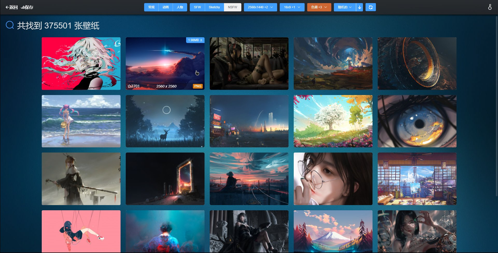
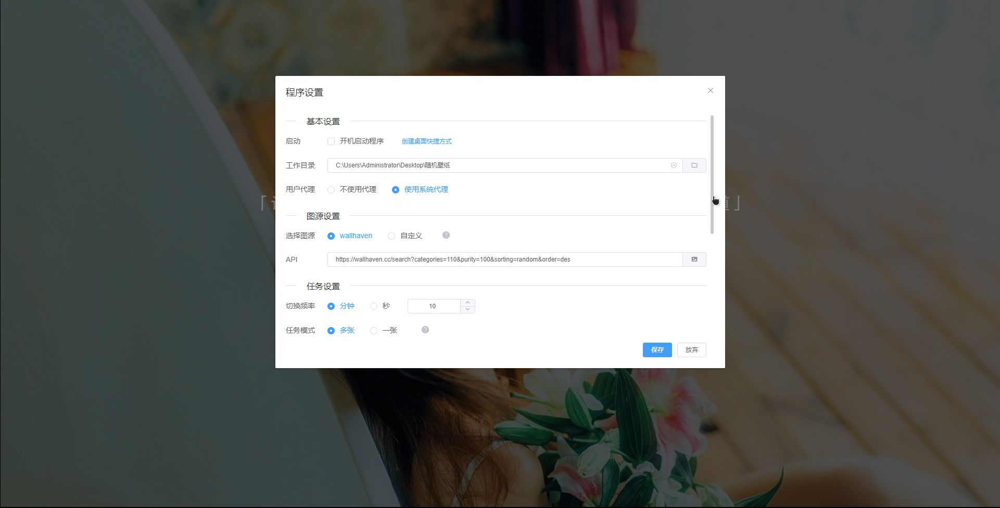

# 随机桌面壁纸

随机桌面壁纸 ，v2，`WEBUI`界面版，本项目开源地址：[GitHub](https://github.com/snwjas/RandomDesktopBackground-WEBUI) | [Gitee](https://gitee.com/snwjas/random-desktop-background-webui)

前身，v1，`控制台`版开源地址：[GitHub](https://gitee.com/link?target=https%3A%2F%2Fgithub.com%2Fsnwjas%2FRandomDesktopBackground) | [Gitee](https://gitee.com/snwjas/random-desktop-background)

## 程序简介

使用`Python 3.8`、`Vue 2`编写的自动拉取网络图源并进行自动轮换桌面壁纸的`Windows`应用程序。

使用它，可以让你的桌面背景像一盒巧克力一样，你永远不知道下一颗是什么味道，是惊还是喜，只有等你去探索去发现。

特性：

- B/S架构开发，提供WEBUI界面可视化配置操作。
- 在线随机壁纸轮换，默认支持[wallhaven](https://wallhaven.cc/)图源，支持自定义图源。
- 支持部分操作全局热键配置，如切换上/下一张壁纸…
- 更多的等待你去发现…

## 环境要求

- Node
- Python 3.8
- virtualenv：`pip install virtualenv`

## 安装使用

准备好以上环境，即可运行本项目

1、初始化：安装web环境依赖；初始化Python虚拟环境并安装相关依赖包

``` bash
npm run Init
```


2、开发环境运行本项目

2.1、同时运行python服务端和WEBUI前端

``` bash
npm run StartDev
```

2.2、分开运行python服务端和WEBUI前端

```bash
npm run PyDev
```

```bash
npm run WebDev
```


3、打包为EXE可执行程序

```bash
npm run BuildExe
```

## 其他说明

- 程序界面服务端默认地址为`127.6.6.6:23333`，程序运行时自动打开，默认界面退出5分钟后自动关闭，也可以访问`127.6.6.6:23333/exit`主动退出界面服务。
- 程序在最后一张壁纸切换完毕后就会重新拉取新的随机壁纸；如果网络不可用，自动重新轮换已下载壁纸。
- 程序在Windows`锁屏状态`下(WIN+L)不会进行切换

## 操作界面

**首页**


**[wallhaven](https://wallhaven.cc/)图源选择页面**



**部分程序设置页面**



## 总结

在决定为这个程序编写一个界面时考虑过几种技术选型，一个是`C/S`，另一个是`B/S`。

如果采用 C/S 的话自己有两条路走，一个是采用传统的界面程序编写客户端，如 QT 这一类的，但考虑到自己不熟悉，学习成本过高，故放弃了；另外是基于前端技术的客户端，因为考虑到自己对前端的东西有了解，几乎没有学习成本，而且使用前端的东西可以比较容易写出漂亮的界面，然后就尝试了`pywebview`这个框架来开发，后来发现这些打包后的体积都比较大，然后又放弃了。

最后折中一下，还是干起了自己的老本行，使用 B/S 架构开发，查了一下目前流行的 Python WEB 框架，选择了`fastapi`，大概入门就开始写了，一套整下来，这个技术选型确实行的通，正常操作是没问题的，打包EXE后的体积也不算太大。其中遇到比较头疼的是 fastapi 启动是以进程方式启动的，搞进程通信实在麻烦，故而放弃了一些点子，但基本功能是保证的。

虽然自己不是搞 Python 的，但是使用 Python 写写简单脚本、小应用程序还是十分便利的。Python 赛高~
